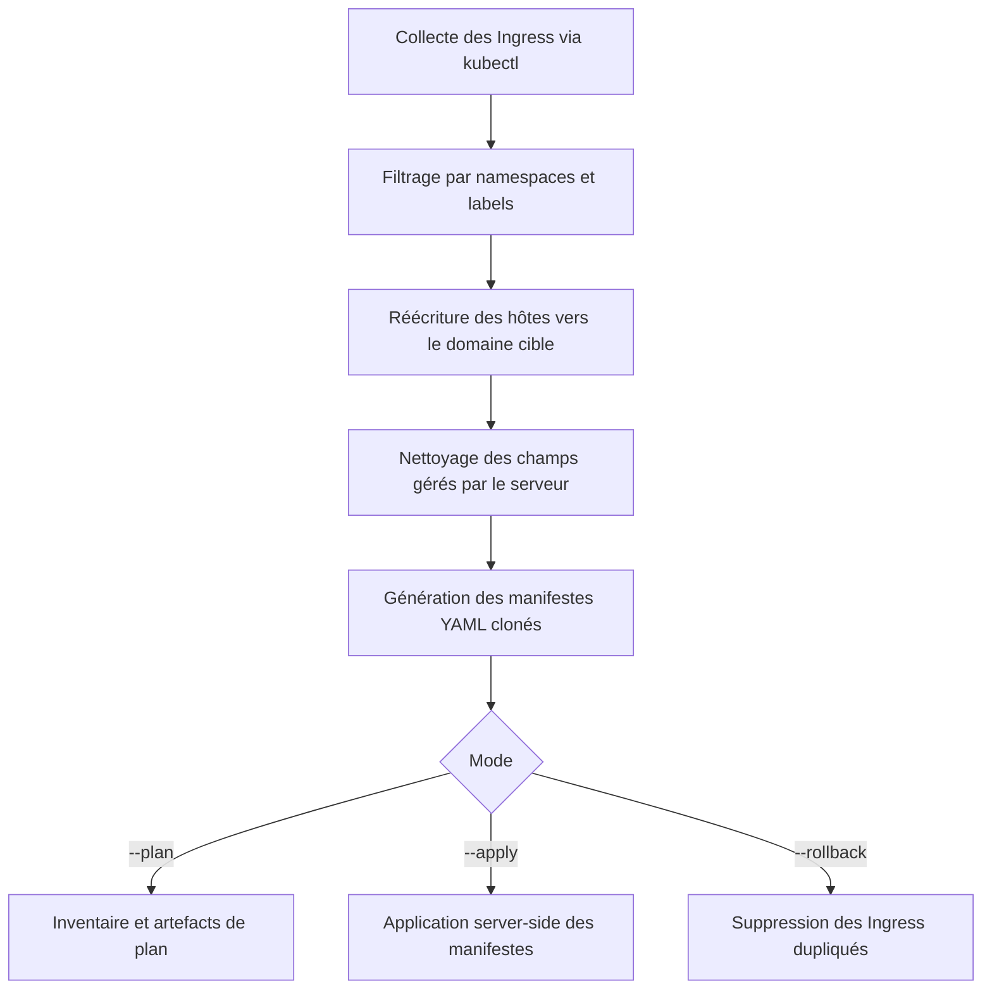

# k8s-domain-migrate

Script utilitaire pour dupliquer des Ingress Kubernetes vers un nouveau domaine racine (par défaut `ai-dev.fake-domain.name`).

## Aperçu

`ingress-duplicate-ai-dev.sh` interroge votre cluster Kubernetes et génère des manifestes YAML clonés pour chaque Ingress correspondant aux sélecteurs fournis. Les hôtes sont automatiquement réécrits vers le domaine cible et divers éléments du manifest sont nettoyés afin d'éviter les conflits lors de l'application.

Le script peut fonctionner en mode plan (génération uniquement), appliquer les manifestes clonés, ou effectuer un rollback en supprimant les ressources dupliquées.

## Diagramme de flux

Le diagramme suivant illustre les grandes étapes lorsqu'on exécute le script en mode `--plan` suivi de `--apply` :



## Prérequis

- Accès `kubectl` configuré vers le cluster concerné
- Binaires : `jq`, `yq`, `curl`
- Bash 4+ avec `set -euo pipefail`

## Variables d'environnement clés

| Variable | Description |
| --- | --- |
| `BASE_DOMAIN` | Domaine racine cible (défaut `ai-dev.fake-domain.name`). |
| `INGRESS_CLASS` | Classe d'Ingress à filtrer (chaîne vide pour toutes). |
| `CERT_ISSUER` | `ClusterIssuer` cert-manager à imposer. |
| `NAMESPACE_SEL` | Liste CSV de regex pour limiter les namespaces interrogés. |
| `LABEL_SEL` | Sélecteur de labels `kubectl` supplémentaire. |
| `DEST_DOMAIN_FORCE` | Domaine cible exact (bypass des heuristiques). |
| `DEST_CLUSTER_FORCE` | Cluster cible (`c0`…`c4`) pour déterminer le domaine. |
| `SUFFIX_BASE` | Suffixe ajouté aux nouveaux noms d'Ingress (défaut `-aidev`). |
| `OUT_DIR` | Dossier de sortie (défaut `./ingress-aidev-out`). |
| `OPENAI_API_*` | Paramètres optionnels pour obtenir un résumé du plan via une API compatible OpenAI. |

## Modes

Le premier argument définit le mode :

- `--plan` (défaut) : récupère les Ingress, prépare les manifestes clonés et écrit un inventaire. Aucun changement n'est appliqué au cluster.
- `--apply` : applique les manifestes générés en mode plan avec `kubectl apply --server-side --force-conflicts`.
- `--rollback` : supprime les Ingress marqués avec `duplicated-for=ai-dev`.

## Sorties

Tous les artefacts sont stockés dans `OUT_DIR` :

- `plan-files.txt` : liste des manifestes générés.
- `before-inventory.txt` et `after-ingresses.txt` : états avant/après des Ingress.
- `*.yaml` : manifestes clonés nettoyés.
- `http-probes.md` : résultats de probes HTTP optionnelles si une IP/hostname LB est détectée.
- `llm-plan-summary.md` : résumé du plan lorsque les variables `OPENAI_API_*` sont définies.

## Exemple

```bash
# Mode plan sur les Ingress publics des namespaces commençant par « ai- »
NAMESPACE_SEL="ai-.*" ./ingress-duplicate-ai-dev.sh --plan

# Application des manifestes générés
./ingress-duplicate-ai-dev.sh --apply

# Rollback des Ingress dupliqués
./ingress-duplicate-ai-dev.sh --rollback
```

## Guide détaillé

Pour un déroulé pas-à-pas couvrant la préparation de l'environnement, la revue du plan et la stratégie de rollback, consultez [docs/guide-migration.md](docs/guide-migration.md).

## Avertissements

- Le script supprime de nombreux champs gérés par le serveur (UID, resourceVersion, status, etc.) pour éviter les conflits.
- Vérifiez les manifestes générés avant de passer en mode `--apply`.
- Les probes HTTP reposent sur l'adresse du premier LoadBalancer détecté ; adaptez-les si besoin.

